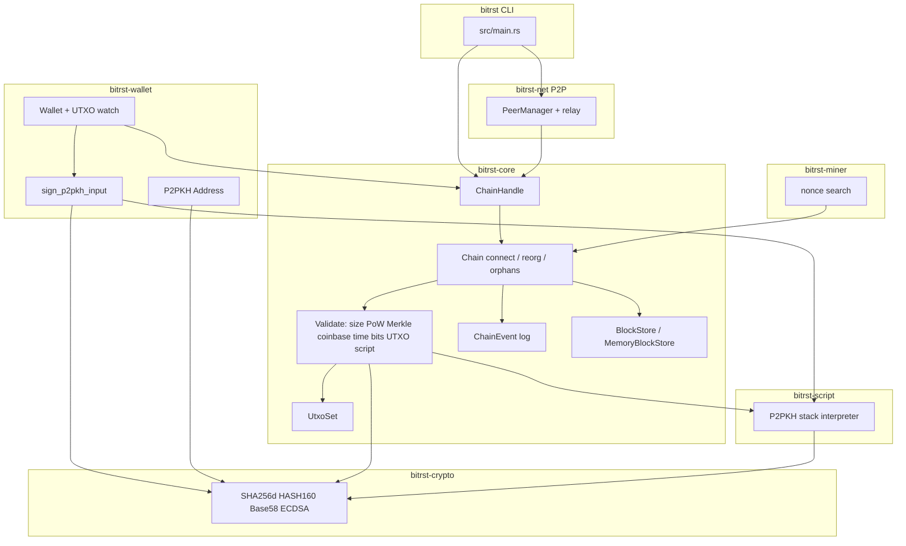
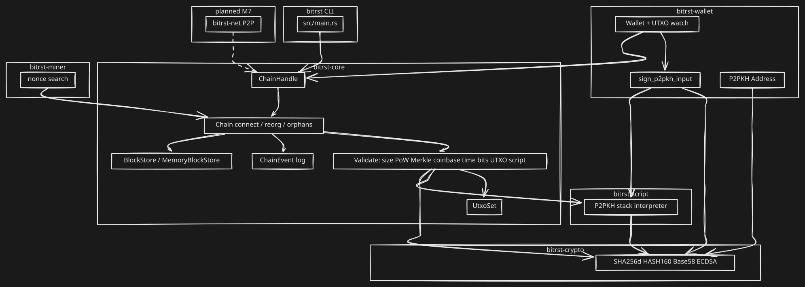

# bitrst


Bitcoin from scratch, in Rust.

## Architecture





Diagram source: [`docs/architecture-diagram.mmd`](docs/architecture-diagram.mmd) · Made with [Mersketch](https://github.com/akshitj11/Mersketch)

## CLI

The `bitrst` binary exposes ephemeral (in-memory) commands:

| Command | Purpose |
|---------|---------|
| `tip` | Print the active chain tip hash |
| `mine` | Mine one or more blocks on a local chain |
| `wallet new` | Generate a P2PKH address (secrets hidden by default) |
| `wallet address` | Derive an address from a private key (`--private-key-stdin`, `BITRST_PRIVATE_KEY`, or `--private-key`) |
| `wallet balance` | Report balance for an address on a genesis-only chain |
| `node` | Run a P2P node via `PeerManager` (Ctrl-C / SIGTERM shutdown) |

Chain and wallet state is not persisted to disk yet; commands print an explicit notice.

```bash
bitrst tip
bitrst mine --count 2 --network-time 1231006505
bitrst wallet new
bitrst wallet address --private-key-stdin   # hex on stdin
bitrst wallet balance --address <addr> --network-time 1231006505
bitrst node --listen 127.0.0.1:8333 --network testnet
```

## Current scope

- Workspace scaffold
- Core, crypto, and miner crates
- SHA-256d hashing with the Bitcoin genesis header test vector
- Block header serialization and hashing
- Full `Block` struct with transaction list and Merkle root validation
- Transaction and UTXO basics
- First proof-of-work nonce search pass
- Difficulty adjustment over 2,016-block periods
- Block timestamp validation (MTP and future-drift limits)
- `Chain` validation: connect blocks, UTXO checks, orphans, reorg by cumulative work
- M4.5 workspace hardening: spec-aligned `block_work`, DoS limits, fork-aware MTP, `ChainHandle`, events, block store trait
- M4.6 chain robustness: reorg snapshot rollback, iterative orphan promotion, `active_hashes`, analytic `serialized_size`
- Universal-guide chain consensus integration tests (reorg safety, orphans, difficulty, validation, events)
- M5 Script VM: P2PKH script verification, legacy sighash, `bitrst-script` stack interpreter
- M6 Wallet: secp256k1 key generation, Base58Check P2PKH addresses, P2PKH signing, and active-chain UTXO tracking
- M7 P2P networking: `bitrst-net` peer manager, handshake, block relay, and CLI `node` command
- Wallet integration tests for signed local spends and reorg-safe event handling
- Mainnet genesis block replay and legacy known vectors (M8)
- CI for tests, clippy, and dependency security (`cargo audit`, `cargo deny`)

## Testing

Fast workspace suite (short difficulty-adjustment period):

```bash
cargo test --all --features test-short-period
```

Use `cargo ci-fast` for the same fast test command with locked dependencies. A full mainnet-interval boundary run (`cargo test --all` without features) is slower but supported.

Legacy known vectors and mainnet genesis replay:

```bash
cargo test --test known_vectors
cargo test --test mainnet_genesis
```

Benchmarks (compile-only in CI; run locally for timings):

```bash
cargo bench --no-run
cargo bench
```

See [`docs/benchmarks.md`](docs/benchmarks.md) for filters and a machine-dependent results template.

## Security

Dependency policy and CI behavior: [`docs/dependency-security.md`](docs/dependency-security.md).

Before pushing dependency changes:

```bash
cargo audit
cargo deny check
```

## Roadmap

1. Block + SHA256d: done
2. Transactions + UTXO: done
3. Proof of work: done
4. Chain validation: done
5. Workspace hardening (M4.5): done
6. Chain robustness (M4.6): done
7. Script VM (M5): done
8. Wallet (M6): done
9. P2P networking (M7): done
10. Benchmarks, genesis replay, and known vectors (M8): done
