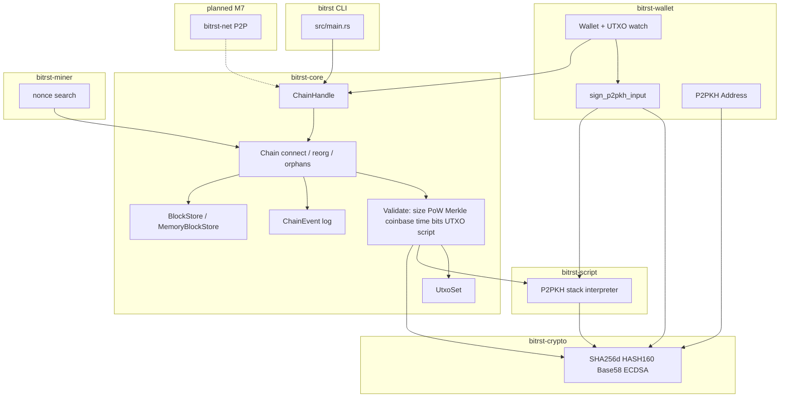

# bitrst


Bitcoin from scratch, in Rust.

## Architecture




Diagram source: [`docs/architecture-diagram.mmd`](docs/architecture-diagram.mmd) · Made with [Mersketch](https://github.com/akshitj11/Mersketch)

## Current scope

- Workspace scaffold
- Core, crypto, and miner crates
- SHA-256d hashing with the Bitcoin genesis header test vector
- Block header serialization and hashing
- Full `Block` struct with transaction list and Merkle root validation
- Transaction and UTXO basics
- First proof-of-work nonce search pass
- Difficulty adjustment over 2,016-block periods
- Block timestamp validation (MTP and future-drift limits)
- `Chain` validation: connect blocks, UTXO checks, orphans, reorg by cumulative work
- M4.5 workspace hardening: spec-aligned `block_work`, DoS limits, fork-aware MTP, `ChainHandle`, events, block store trait
- M4.6 chain robustness: reorg snapshot rollback, iterative orphan promotion, `active_hashes`, analytic `serialized_size`
- Universal-guide chain consensus integration tests (reorg safety, orphans, difficulty, validation, events)
- M5 Script VM: P2PKH script verification, legacy sighash, `bitrst-script` stack interpreter
- M6 Wallet: secp256k1 key generation, Base58Check P2PKH addresses, P2PKH signing, and active-chain UTXO tracking
- Wallet integration tests for signed local spends and reorg-safe event handling
- CI for tests, clippy, and dependency security (`cargo audit`, `cargo deny`)

## Testing

```bash
cargo test --all --features test-short-period
```

Use `cargo ci-fast` for the same fast test command with locked dependencies. A full mainnet-interval boundary run (`cargo test --all` without features) is slower but supported.

## Security

Dependency policy and CI behavior: [`docs/dependency-security.md`](docs/dependency-security.md).

Before pushing dependency changes:

```bash
cargo audit
cargo deny check
```

## Roadmap

1. Block + SHA256d: done
2. Transactions + UTXO: done
3. Proof of work: done
4. Chain validation: done
5. Workspace hardening (M4.5): done
6. Chain robustness (M4.6): done
7. Script VM (M5): done
8. Wallet (M6): done
9. P2P networking: next
